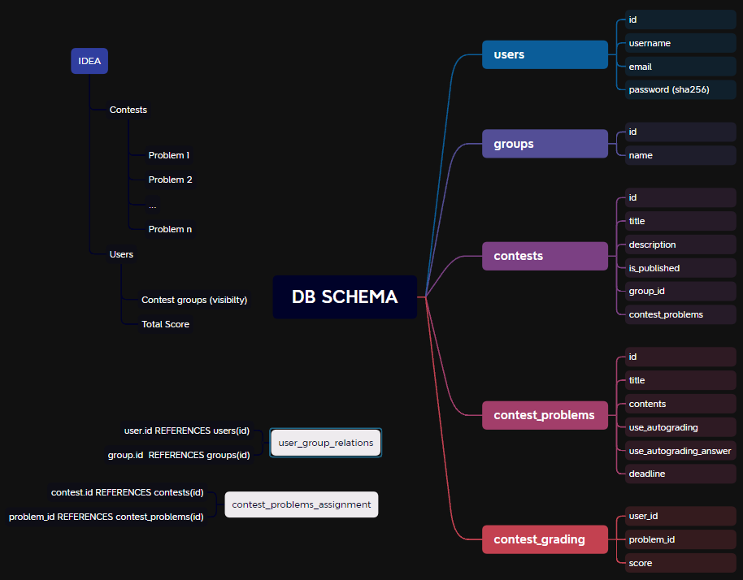

## ContestHub - A website to host Contests

**ContestHub** is a web application designed to host online contests. It allows competitors to submit their entries, check problem statements, and participate in organized contests.

Features:
- [x] User Authentication: Competitors can log in to the platform.
- [x] Contest Management: Admins can create, edit, and close contests.
- [ ] Problem Statements: Each contest contains a set of problem statements that participants can access. Problem statements may include text descriptions, input/output examples, and constraints.
- [ ] Submission Portal: Competitors can submit their solutions for specific problems within a contest. Submissions are automatically timestamped. **Solutions may require uploading files**
- [ ]Judging System: Submissions are evaluated based on predefined criteria. Admins can review and assign scores to submissions.
- [x] Leaderboard: The platform maintains a real-time leaderboard that ranks participants based on their scores.
- [ ] User Profiles: Competitors can view their submission history and stats.

### Dev info

#### Quick Start Guide via Docker Compose

1. Clone the repistory  
    ```bash
    git clone https://github.com/Rafisto/competition-website.git
    cd competition-website
    ```

2. Modify `compose.yml`:<br/>
    2.1. populate production environment variables
    ```ini
    - POSTGRES_PASSWORD=<your_password>
    ```

3. Run the application via `docker compose` in `-d` detach mode
    ```bash
    docker compose up -d
    ```

4. Frontend service is available at `http://localhost:80`

#### Database Schema using a mind map



#### Frontend Showcase - Login Page


